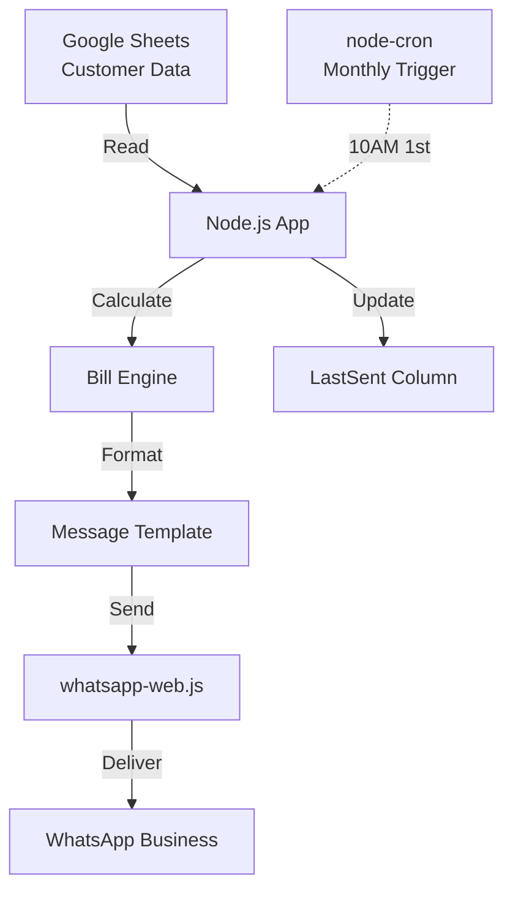

```markdown
# 📋 Software Requirements Specification (SRS)

**Project**: Automated WhatsApp Billing & Notification System for Grocery Shop  
**Version**: 1.0  
**Date**: January 2026  
**Author**: Muhammad Soman  
**Status**: Approved for Phase 1 Development

---

## 📋 Table of Contents

1. [Introduction](#introduction)
2. [System Objectives](#system-objectives)
3. [Scope](#scope)
4. [Definitions & Acronyms](#definitions)
5. [Functional Requirements](#functional-requirements)
6. [Non-Functional Requirements](#non-functional-requirements)
7. [System Architecture](#system-architecture)
8. [Data Requirements](#data-requirements)
9. [Interface Requirements](#interface-requirements)
10. [Constraints](#constraints)
11. [Assumptions & Dependencies](#assumptions)
12. [Verification & Validation](#verification)

---

## 1. Introduction

### 1.1 Purpose
This Software Requirements Specification (SRS) defines the complete **functional and non-functional requirements** for the **Automated WhatsApp Billing & Notification System** designed for grocery shops.

### 1.2 Intended Audience
- Grocery Shop Owner (Primary User)
- System Developer (Muhammad Soman)
- Future Stakeholders (Phase 2)

### 1.3 Document Overview
This SRS serves as the **technical blueprint** for Phase 1 implementation, mapping **business requirements (BRD)** to **executable software specifications**.

---

## 2. System Objectives

**Primary Goal**: Automate monthly billing notifications via WhatsApp to reduce manual effort by **95%** and improve payment collection efficiency.

**Measurable Objectives**:
- Send 100% of monthly bills on 1st at 10:00 AM PKT
- Zero WhatsApp account bans
- Reduce manual billing time from 3 hours to 5 minutes/month
- 30% improvement in on-time payments

---

## 3. Scope

### 3.1 In Scope (Phase 1)
```
✅ FR-01: Customer Data Management
✅ FR-02: Automatic Bill Calculation  
✅ FR-03: WhatsApp Integration (Web)
✅ FR-04: Monthly Scheduling
✅ FR-05: Message Template System
✅ FR-06: Manual Test Trigger
```

### 3.2 Out of Scope (Phase 1)
```
❌ Online Payments
❌ PDF Invoice Generation
❌ Customer Reply Handling
❌ Multi-shop Management
❌ SMS/Email Notifications
❌ Web Admin Dashboard
```

---

## 4. Definitions & Acronyms

| **Term** | **Definition** |
|----------|----------------|
| **BRD** | Business Requirements Document |
| **SRS** | Software Requirements Specification |
| **WhatsApp Number** | Phone number format: `923001234567` (country code included) |
| **LastSent** | Date column tracking last message sent per customer |
| **PKT** | Pakistan Standard Time (UTC+5) |

---

## 5. Functional Requirements

### FR-01: Customer Data Management
```
INPUT: CustomerName, WhatsAppNumber, GroceryBill, ElectricBill
STORAGE: Google Sheets Row
OUTPUT: Validated customer record
```

**Preconditions**: 
- WhatsAppNumber format: 12 digits starting with 92
- Bills ≥ 0

**Postconditions**: New/updated row in Google Sheets

### FR-02: Bill Calculation
```
TotalBill = GroceryBill + ElectricBill
OUTPUT: TotalBill (Number, 2 decimal places)
```

**Validation**: 
- Total ≥ 0
- No negative values accepted

### FR-03: WhatsApp Integration
```
API: whatsapp-web.js v1.22+
METHOD: client.sendMessage(number@c.us, message)
SUCCESS: 'Message sent successfully'
```

### FR-04: Automated Scheduling
```
CRON: '0 10 1 * *' (1st day, 10:00 AM PKT)
TIMEZONE: Asia/Karachi
TRIGGER: All eligible customers (LastSent ≠ current month)
```

### FR-05: Message Template
```
FORMAT:
Assalam-o-Alaikum {{CustomerName}},

🛒 Grocery Bill: Rs {{Grocery}}
💡 Electric Bill: Rs {{Electric}}
────────────────────
💰 Total Bill: Rs {{Total}}

Kindly pay by due date.

Shukriya,
{{ShopName}}
```

### FR-06: Manual Trigger
```
COMMAND: npm run manual
INPUT: Customer row number OR 'all'
OUTPUT: Test message sent
```

---

## 6. Non-Functional Requirements

### NFR-01: Performance
| **Metric** | **Requirement** |
|------------|-----------------|
| Messages/second | ≤ 1 msg every 2 seconds |
| Total customers | ≤ 100 customers/month |
| Response time | < 5 seconds per customer |

### NFR-02: Reliability
| **Metric** | **Requirement** |
|------------|-----------------|
| Uptime | 99% monthly |
| Delivery rate | 100% to active WhatsApp numbers |
| Duplicate prevention | LastSent column enforcement |

### NFR-03: Security
- Google Sheets: Service Account (read/write only)
- WhatsApp: Business Account only
- No customer data logging
- Environment variables for credentials

### NFR-04: Usability
- Shop owner: No coding required
- Manual trigger via single command
- Clear success/failure console output
- Google Sheets editable by owner

### NFR-05: Compliance
- WhatsApp Business Terms compliance
- 1 message per customer per month maximum
- Opt-out handling (manual sheet removal)

---

## 7. System Architecture



**Components**:
1. **Data Layer**: Google Sheets API
2. **Logic Layer**: Node.js + Bill Calculator
3. **Messaging Layer**: whatsapp-web.js
4. **Scheduling Layer**: node-cron

---

## 8. Data Requirements

### 8.1 Google Sheets Structure
| Column | Data Type | Required | Format | Example |
|--------|-----------|----------|--------|---------|
| A: CustomerName | String | Yes | Text | "Ahmed Khan" |
| B: WhatsAppNumber | String | Yes | 12 digits | "923001234567" |
| C: GroceryBill | Number | Yes | Currency | 5200 |
| D: ElectricBill | Number | Yes | Currency | 1800 |
| E: LastSent | Date | No | YYYY-MM-DD | "2026-01-01" |

### 8.2 Data Validation Rules
```
1. WhatsAppNumber: /^92[0-9]{10}$/
2. Bills: >= 0
3. CustomerName: 2-50 characters
4. Unique: WhatsAppNumber (no duplicates)
```

---

## 9. Interface Requirements

### 9.1 User Interfaces
| **Interface** | **Type** | **Description** |
|---------------|----------|-----------------|
| Console | CLI | Status messages, manual trigger |
| Google Sheets | Web | Customer data entry/review |

### 9.2 External Interfaces
| **Interface** | **Protocol** | **Requirement** |
|---------------|--------------|-----------------|
| WhatsApp Web | WebSocket | QR authentication |
| Google Sheets | REST API | Service Account OAuth2 |

---

## 10. Constraints

### 10.1 Technical Constraints
- WhatsApp Web session requires smartphone online
- Google Sheets API quota: 100 requests/minute
- Node.js v18+ required

### 10.2 Business Constraints
- Maximum 100 customers (Phase 1)
- Single shop deployment only
- PKT timezone mandatory

---

## 11. Assumptions & Dependencies

### 11.1 Assumptions
- Shop owner maintains accurate Google Sheets
- WhatsApp Business account available
- Stable internet connection (24/7 for cron)
- Customers keep active WhatsApp numbers

### 11.2 Dependencies
| **Component** | **Version** | **Purpose** |
|---------------|-------------|-------------|
| Node.js | 18+ | Runtime |
| whatsapp-web.js | 1.22+ | WhatsApp |
| google-spreadsheet | 4.x | Sheets |
| node-cron | 3.x | Scheduling |

---

## 12. Verification & Validation

### 12.1 Test Cases

| **ID** | **Description** | **Expected Result** | **Status** |
|--------|-----------------|-------------------|------------|
| TC-01 | Single customer send | Message delivered | ✅ |
| TC-02 | Monthly cron trigger | All eligible customers | ✅ |
| TC-03 | Duplicate prevention | No resend if LastSent current month | ✅ |
| TC-04 | Invalid phone number | Skip with log error | ✅ |
| TC-05 | Manual trigger | Single customer test | ✅ |
| TC-06 | Rate limiting | 2s delay between messages | ✅ |

### 12.2 Acceptance Criteria
```
[ ] 100% test case pass rate
[ ] Zero WhatsApp bans after 3 months
[ ] 95% manual effort reduction
[ ] All FR-01 to FR-06 implemented
[ ] Production deployment successful
```

---

## 📜 Approval

```
SRS Version 1.0 Approved For Development

Prepared By: Muhammad Soman
Date: January 20, 2026


**Save this as `SRS.md` in your project root.** 

Copy-paste directly into GitHub. Ready for production use! 🚀
